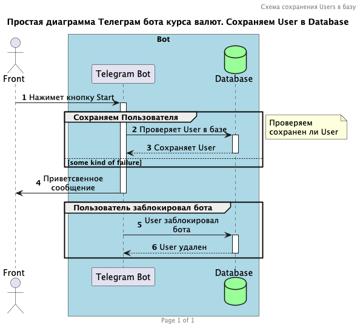

# TelegramBotRates
Описание：
- TelegramBotRates  - бот предоставляющий пользователям информацию о курсах валют Центрального Банка РФ (ЦБ РФ), а также курсы доллара и евро в банках Москвы на текущую дату, криптовалюты.

## Содержание
- [Технологии](#технологии)
- [Использование](#использование)
- [Разработка](#разработка)
- [Docker](#docker)
- [Простой UML](#uml)
- [Запуск проекта на VDS сервер](#запуск-проекта-на-vds-сервер)
- [To do](#to-do)
- [Команда проекта](#команда-проекта)

## Технологии

- Java 17
- Spring Boot 3.3.1
- Mysql 8.0.28
- [Flyway](https://hub.docker.com/r/dhoer/flyway)
- Docker


## Использование
Чтобы запустить в Docker:

Для запуска всех необходимых сервисов, которые включают в себя базу данных MySQL, Flyway и приложение, выполните следующую команду::
```sh
$ docker-compose up -d
```


```typescript
# Также запускать проект можно следующим образом: 
docker-compose up -d mysqldb 
# Подождите минуту, пока MySQL будет инициализирован 
# (или выполните команду tail logs с помощью docker-compose logs -f), 
# затем запустите 
docker-compose up -d flyway

```

Доступ к MYSQL:
```typescript
docker exec -it <CONTAINER NAME> bash
mysql -u root -p 
systemctl restart mysql   #перезапуск MySQL для Ubuntu, Debian
ps axuw | grep mysql  #Эта команда должна вывести список процессов MySQL. 

```

## Разработка

### Функционал
- Получение курсов валют (USD, EUR) ЦБ РФ
- Получение купли-продажи валют в банках Москвы (USD, EUR)
- Получение курсов криптовалюты
- Регистрация пользователей в базе данных
- Отправка уведомлений всем пользователям из базы по времени
- Отправка уведомлений администратором чата при указании команды в тексте сообщения.

### Технологический подход
- Spring Boot: используется для разработки веб-сервисов и телеграм бота.
- XML и JSON парсинг: для получения данных о курсах валют и крипты используются технологии XML и JSON парсинга.
- Кэширование: для ускорения обработки запросов используется кэширование данных, чтобы не обращаться каждый раз к источнику данных.
- Telegram Bot API: для интеграции телеграм бота и получения данных о пользователях и их сообщениях.


### Получение данных для бота
#### Курсы доллара и евро, которые можно взять с официального сайта ЦБ РФ:
1) http://www.cbr.ru/scripts/XML_daily.asp
2) https://www.cbr-xml-daily.ru/daily_json.js

Первая ссылка возвращает XML, который содержит информацию о курсах валют, установленных на текущий день. 
Для реализации использовались простые библиотеки Оkhttp и XPath.
Также для сравнения, с целью получения курса ЦБ РФ, использовала json.
В проект добавлены обе вариации.
С целью производительности добавлено кэширование.

#### Криптовалюта

Для получения криптовалюты использовалась библиотека Jsoup для парсинга данных с веб-страницы.


#### Курсы USD, EUR в банках Москвы
Для получения криптовалюты использовалась библиотека Jsoup для парсинга данных с веб-страницы.

## Docker

- Docker-compose: файл compose.yml используется для определения и управления несколькими контейнерами Docker.
- Dockerfile: файл Dockerfile определяет конфигурацию для Docker-образа, включая источник и место сборки исходного кода, а также действия, которые Docker должен выполнить при создании образа.
- Переменные окружения: определены внутри файла .env. вы можете использовать переменные окружения для передачи параметров приложению, такие как имя бота, токен бота, имя пользователя базы данных и пароль базы данных.

```typescript

docker-compose ps
# для отображения списка запущенных контейнеров и их статусов.
 
docker-compose build -d
# сборка

docker-compose up -d [SERVICE]
# для запуска конкретной службы из файла compose.yml. 

docker-compose up --force-recreate
# заставляет Docker Compose пересоздать контейнеры 

docker-compose up -d --build
# пересобрать 

docker-compose logs -f
# просмотреть логи 


```

## Простой UML 
### Описание работы бота (Сохраняем Users в базу) с помощью PlantUml 





https://plantuml.com/ - сайт с отличной документацией по PlantUML
Для тех, кто пишет документацию рядом с кодом — [плагин](https://plugins.jetbrains.com/plugin/7017-plantuml-integration) «PlantUML Integration» для Idea 


## Запуск проекта на VDS сервер
Чтобы запустить сервер для разработки, выполните команду:
```sh
sudo apt update
 
sudo apt upgrade
 
# Устанавливаем Docker
curl -fsSL https://get.docker.com -o get-docker.sh
sudo sh get-docker.sh
 
# Создаем директорию проектов
mkdir projects
cd projects

# Клонируем репозиторий в созданную папку projects
git clone https://github.com/AlimeAmetova/TelegramBotRates.git
# Адрес с github укажите свой
 
# Входим в него
# cd имя_папки_проекта в нашем случае это TelegramBotRates
cd TelegramBotRates 
 
#Открываем файл.env:
vim .env 
#Указываем токен бота и другие переменные. После внесения изменений нажимаем "ESC" для выхода в "командный режим", вводим ":" (двоеточие), вводим "wq" (write-quit) - для сохранения изменений и выхода; "q!" - для выхода без сохранения, и нажимаем "Enter".
 
#Запускаем docker compose:
sudo docker compose up -d --build   
 
#Чтобы увидеть логи введите:
docker compose logs -f


```


### Зачем разработали этот проект? 
Пэт-проект.

## To do
- [x] Добавить на сервер
- [ ] Проверить кэширование после 24:00 курсов валют ЦБ РФ которые обновляются ежедневно
- [ ] Проверить ошибку api.telegram.org: Temporary failure in name resolution 

## Команда проекта
Контакты
- [Алиме Аметова](https://t.me/alimeametova) — Junior Java Разработчик

